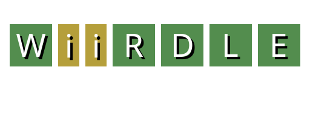
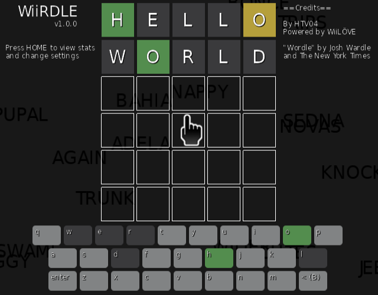

# 
Wiirdle is a [Wordle](https://www.nytimes.com/games/wordle/index.html) clone for the Wii, powered by the [WiiLÖVE](https://github.com/HTV04/wiilove) framework.

Every day, you will have six attempts to guess a five-letter word, with feedback given for each guess indicating when letters match or occupy the correct position.

*Wordle* by Josh Wardle and the New York Times. Play the original game [here](https://www.nytimes.com/games/wordle/index.html)!

# Screenshot

